# core-v-mcu-sdk
Eclipse+FreeRTOS SDK for core-v-mcu

## Background
The purpose of this repo is to hold the common files that are shared among many applications.  THe idea is that a developer will load this repo into their workspace, and then create (or load) other projects that contain the application specific code.  Those projects will use the library file that is the output of this project to access the common functions.

## Setting up the Eclipse environment
Eclipse relies on a larger ecosystem of tools.  This project uses a particualr set of tools in a particular set of locations.  These instructions do not cover loading the other tools, or adapting the preferences to point to different tools or different locations.  These instructions assume that you are familar enough with Eclispe to make any required changes.
### Step 1: 
Download and install Eclipse for Embedded and not Host based eclipse.  
~~~
https://www.eclipse.org/downloads/packages/release/2021-03/m1
~~~

Be sure to load the Eclipse IDE for Embedded C/C++ Devlopers
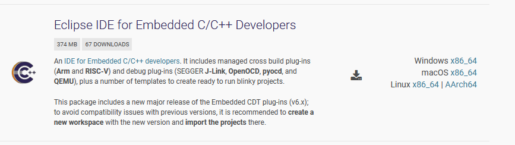

### Step 2:
Install OpenOCD.  Recommend getting it from this location:
~~~
https://sourceforge.net/projects/openocd/files/openocd/
~~~
I used 0.11.0-rc2.
Installation is accomplished by:
~~~
./configure && make
sudo make install
~~~

### Step 3: run Eclipse and import the core-v-mcu-sdk project directly from git (import the cli-test project in step 4)
~~~
eclipse
~~~
NOTE: importing the uart_test does not imprt the information to launch the debugger, so after importing uart_test, be sure to either import the launch configuration or create you own.
- create and launch a new workspace then select import existing projects

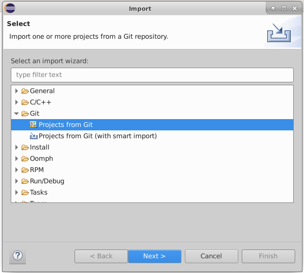
- select clone URL

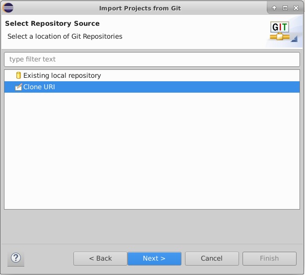
- paste repo name into URL field

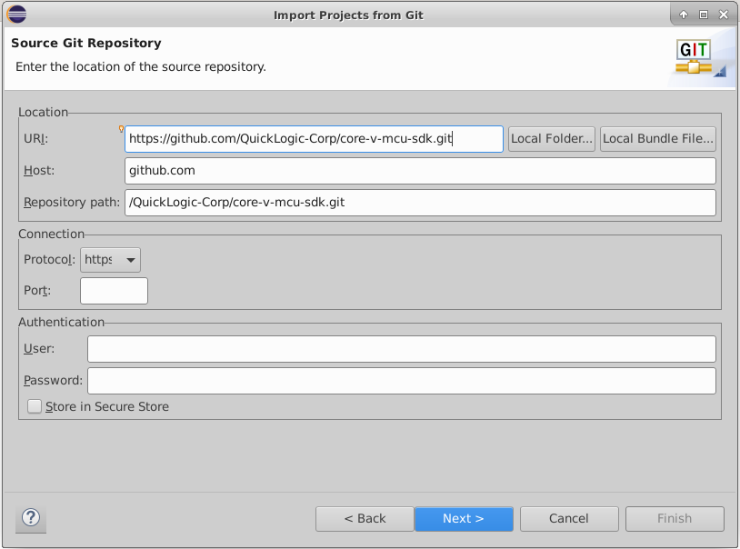

- specify folder to put files in (default is git/reponame)

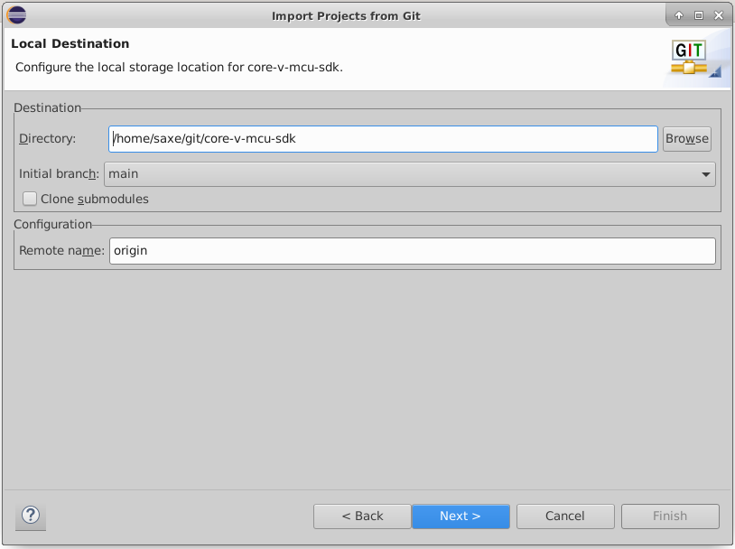

- select the branch to use

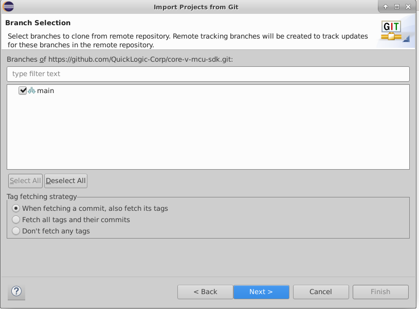

- select the import wizard (default works fine)

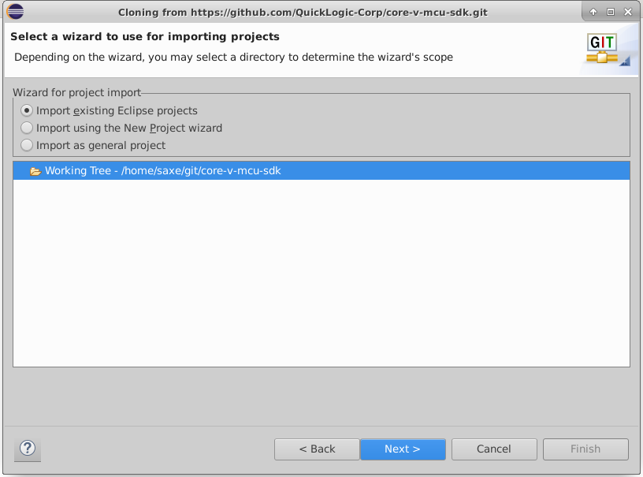

- tell it to actually import form the repo

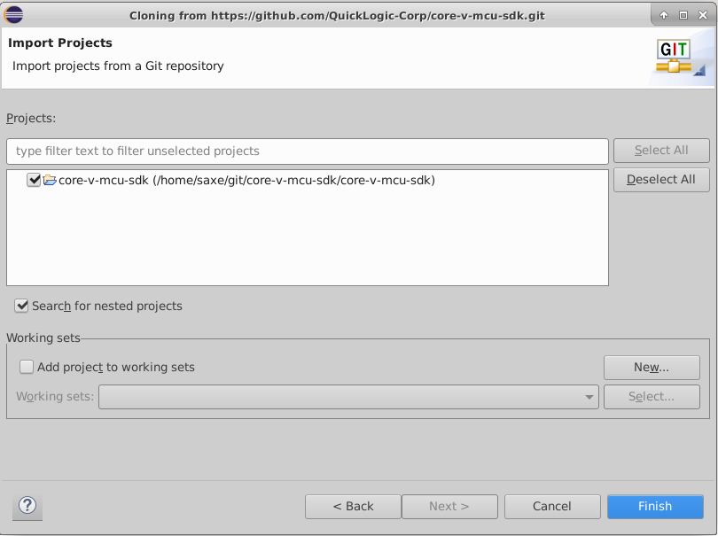

- this is what it looks like when the import has finished

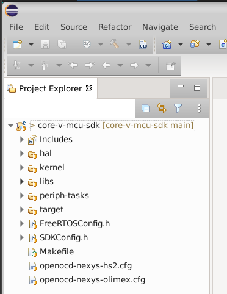

- at this point you should execute 'Build project...' on the core-v-mcu-sdk project

### Step 4: next, import the core-v-mcu-cli-test project directly from git (import the launch configurations in step 5)

Repeat the procedure from Step 3, substituing QuickLogic-Corp/core-v-mcu-cli-test.git as the repo name.

A example workspace after loading both the SDK and the core-v-mcu-cli-test application is:
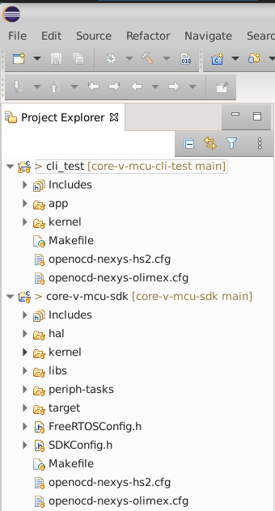

At this point you should execute 'Build project...' on the core-v-mcu-cli-test project

### Step 5: Import launch configuration
This step pulls in the launch configurations which are configured to use hs2 and OpenOCD.
If your hardware setup is different, you can either ignore this step and create your own, or use this step and modify to fit your configuration.

- select import launch configurations

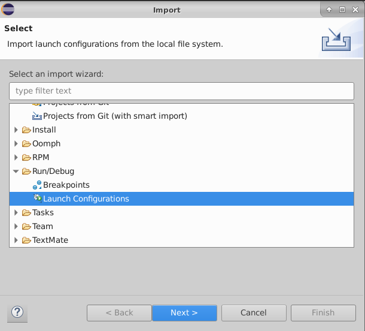

- specify the directory where the files were imported (default is git/reponame)

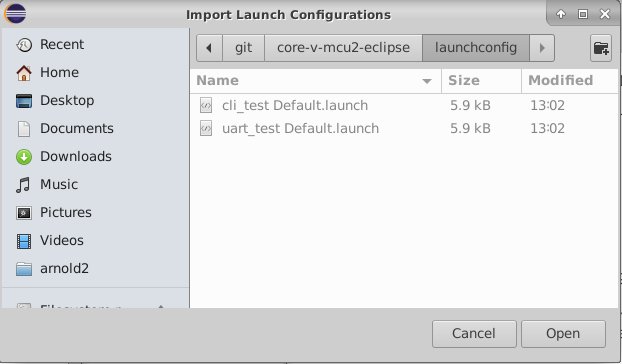

- select which launch configurations to import

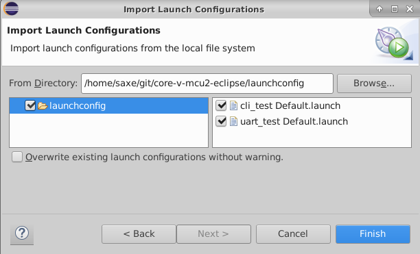

- under debug>Debug configurations ... choose GDB OpenOCD>config a click Debug

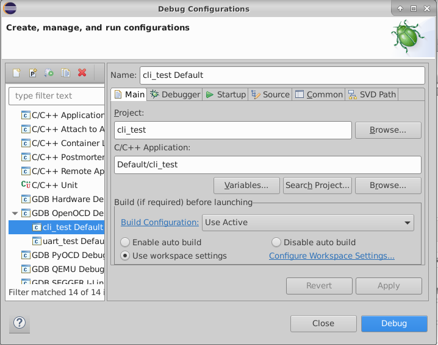

This should compile, link and load the application and stop at main waiting for you to start debugging.

When you run the progam it will write various messsage to the console (/dev/ttyUSBXX) ending with a CLI prompt '>'.
Enter 'help' and you should see a help message.

# Directory structure

After loading both the SDK and cli-test the folder structure is:

The cli-test project has the following items:

| Folder/File       | Purpose |
| ----------        | ------- |
| Includes          | application specific include files |
| app               | application specific source files  |
| kernel            | portASM.S from the FreeRTOS kernel                   |

The core-v-mcu project has the following items:

| Folder/File       | Purpose |
| ----------        | ------- |
| Includes          | application specific include files                        |
| hal               | includes and sources that directly access the hardware    |
| kernel            | the FreeRTOS kernel (except portASM.S)                    |
| libs              | various application libraries                             |
| drivers           | includes and sources for drivers (needs to be created)    |
| periph-tasks      | tasks assoctiated with accessing peripherals (to be replaced by drivers)  |
| target            | various information about the core-v-mcu core such as memory map and peripheral counts                         |
| FreeRTOSConfig.h  | defines the characteristics of the FreeRTOS (this is actually application specific -- unfortunately I don't see how to include it in the application project) |
| SDKConfig.h       | global defines that configure the SDK (also need to find a way to push into application project) |